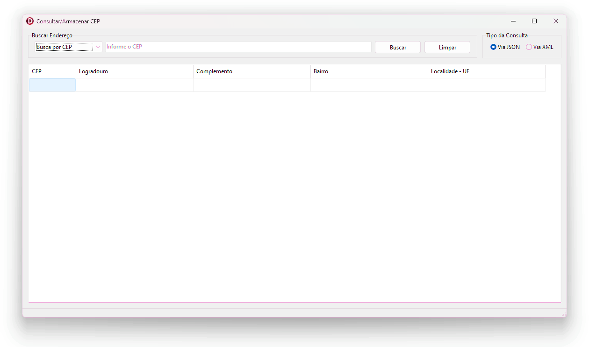
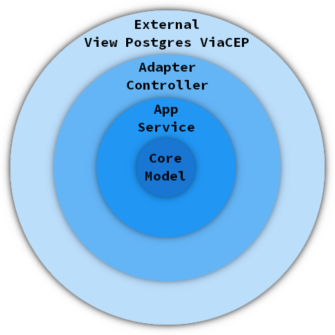

# MVP Consulta Armazena CEP

## Descrição
MVP (Minimum Viable Product) desenvolvido para realizar consultas de CEP utilizando o serviço público do [ViaCEP](https://viacep.com.br/). 

## Motivação
O projeto foi desenvolvido como parte de um desafio técnico, com foco em demonstrar o uso de componentes próprios, integração com APIs públicas e aplicação de princípios de engenharia de software.

## Tecnologias Utilizadas
- **Delphi 12 (versão de demonstração)**
- **PostgreSQL** como banco de dados
- **Componente de acesso ao Web Service da ViaCEP** autoral desenvolvido para o projeto

## Desenvolvimento e Configuração
Para compilar e testar o projeto, siga os passos abaixo:

1. **Configurar o banco de dados PostgreSQL**:
   - Crie uma nova base de dados vazia no PostgreSQL.
   - Instale o client do PostgreSQL no seu sistema.
  
2. **Configurar o arquivo `Config.ini`**:
   - Edite o arquivo `Config.ini`, inserindo as informações de acesso ao banco de dados (host, usuário, senha, etc.).

3. **Instalar o componente personalizado**:
   - Instale o componente de acesso ao Web Service da ViaCEP no Delphi. Esse componente é parte essencial do projeto e deve estar corretamente configurado antes da compilação.

4. **Compilar o projeto**:
   - Abra o projeto no Delphi 12 e compile-o normalmente.

## Execução do Programa
O sistema é uma aplicação Windows (VCL) com interface gráfica. Para executá-lo, siga os passos abaixo:

1. **Configurar o banco de dados**: Instale o Client do PostgreSQL e edite o arquivo `Config.ini` corretamente.
2. **Iniciar a aplicação**: Execute o arquivo Win64\Release\PrConsultarArmazenarCEP.exe gerado após a compilação.
3. **Utilizando a aplicação**: Estando tudo certo, você verá a tela abaixo. A aplicação permite consultas de CEP utilizando a API do ViaCEP.

## Princípios e Padrões Adotados (principais)

### Design Patterns
- **Singleton**: Para garantir que certos objetos tenham apenas uma instância.
- **Factory Method**: Para encapsular a criação de objetos, promovendo flexibilidade na escolha de instâncias.

### Clean Code
- **Nomes Significativos**: Uso de nomes de variáveis e funções que refletem claramente seu propósito.
- **Funções Simples**: Cada função tem uma única responsabilidade e é pequena o suficiente para ser entendida sem necessidade de comentários.
- **DRY (Don't Repeat Yourself)**: Evitamos a repetição de código ao máximo, promovendo reutilização e modularidade.
- **Padrões de Formatação**: Uso de Pascal Case e Variáveis e Métodos em português, prática comum em equipes de desenvolvedores Delphi.

### Princípios SOLID
- **Single Responsibility Principle (SRP)**: Cada classe ou função tem uma única responsabilidade.
- **Interface Segregation Principle (ISP)**: Interfaces são específicas e não obrigam os consumidores a implementar métodos que não usam.
- **Dependency Inversion Principle (DIP)**: A aplicação depende de abstrações, não de implementações concretas.
- **Arquitetura em Camadas**: A estrutura do código foi cuidadosamente projetada para seguir os princípios de design SOLID, garantindo uma arquitetura flexível, extensível e de fácil manutenção. Cada camada da aplicação é responsável por uma parte específica da lógica, respeitando a separação de responsabilidades e facilitando futuras expansões ou alterações.

A substituição de componentes e tecnologias utilizadas poderá ser feita com facilidade. A Camada de Aplicação(Service) faz acesso aos repositórios fazendo o uso de Protocolos(Interfaces) através inversão de dependência, isso possibilita a troca da Base de Dados Postgres por outra como MongoDB, Oracle ou até mesmo por uma API Rest facilmente adicionando apenas os _Repostiories_ e alterando a _Unit Factory_; e o mesmo se aplica ao componete criado/utilizado para consulta a ViaCEP. Na camada View temos o Form VCL, que por conta do isolamento, pode ser substituido por um Form FireMonkey ou até mesmo por componentes HTML Server possibilitando a transformação desses software em uma API Rest sem nenhuma alteração nas demais camadas.

## TODO List
- **Criptografia de senhas**: Implementar a criptografia da senha no arquivo de configurações (`Config.ini`) para maior segurança.
- **Thread para consultas**: Implementar o uso de Threads no fluxo principal de Busca da aplicação para evitar o bloqueio da interface.

## Manutenção do Código Fonte
Para manter e evoluir o código, siga as práticas de Clean Code e os princípios SOLID adotados no projeto. É importante garantir que novas funcionalidades respeitem os padrões existentes, como a reutilização de código e o uso de boas práticas de nomeação e design.

Ao adicionar novos recursos:
- Verifique a viabilidade de encapsular lógicas repetitivas em novas funções.
- Teste exaustivamente novas integrações com o banco de dados e serviços externos (como a API ViaCEP).
